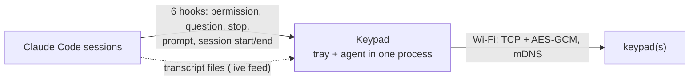

# Keypad

A small hardware keypad for [Claude Code](https://claude.com/claude-code): watch what Claude is doing on a color screen, and allow or deny tool use, answer questions, or tell it to keep going, with one press. It talks to your computer over Wi-Fi (the USB cable is for power, one-time pairing and flashing), on macOS and Windows, across all your open Claude Code sessions.

It runs on a LILYGO T-Display S3 with a 2×4 key matrix and a rotary encoder ([hardware](docs/HARDWARE.md)), with a battery if you add one.

```
              +----------------------------------+
   knob       |                                  |
  .-----.     |             screen               |
 (   o   )    |                                  |==== USB-C cable
  '-----'     |                                  |
  turn: 4/8   +----------------------------------+
  press: Enter
              [1]    [2]    [3]    [4 up]
              [5]    [6]    [7]    [8 down]
```
Keys **1-3** pick an option, **4/8** move up/down, **7** is Enter, **5** goes back (and ends the "Claude finished" screen), **6** lists sessions. Turning the knob works like 4/8, and pressing it down is Enter.


## What it does

- **A live feed of your session.** The main screen is the terminal tab in miniature: its title, your prompts, Claude's messages, `⏺ Bash(pytest)` tool calls, errors, `✻ Working… (1m 12s)` and the permission mode. It follows the session's transcript file, so Claude's text appears as it is written. Claude's Markdown is laid out for the small screen (headings, lists, quotes, tables, code blocks, links, bold and italics) instead of showing raw symbols. **4/8** scroll back; **6** lists all sessions (or follow the latest activity).
- **A keyboard for Claude.** Permission dialogs (*1 Yes · 2 Yes, and don't ask again · 3 No*, with a colored diff for edits), Claude's `AskUserQuestion` (single or multi-select), and when Claude finishes: *continue* or one of your saved prompts.
- **Decisions are made on the keypad.** Option choices have no "answer on the PC" button: you pick with the number keys, or move and press Enter. Claude Code's own prompt only takes over when the keypad can't: it is paused, not connected, or nobody answered in time. If the request gets answered in the terminal anyway, the keypad dialog goes away by itself.
- **Wi-Fi and battery.** Pair once over USB; afterwards the keypad works anywhere on your network, encrypted, and shows its signal and battery level (also in the tray). On a USB wire or charger the screen stays at full brightness; on battery it dims after a minute and lights up on a key press or a request.
- **Tray icon** on macOS and Windows: sessions, state colors, pairing, saved prompts and settings.

Nothing is ever auto-approved. If the keypad is away, paused, times out, or anything fails, Claude Code behaves exactly as it does without it.

| Key | Does |
|---|---|
| **1 2 3** | pick option 1, 2 or 3 at once |
| **4** / **8** | up / down: move the cursor, or scroll |
| **7** | Enter: select the highlighted option |
| **5** | Esc: back (and *done* on the "Claude finished" screen). It does nothing on a decision |
| **6** | the session list |
| knob | turn = up/down, press = Enter (the same as 7) |

## Install

**macOS (12+):** open `Keypad-<version>.dmg`, drag **Keypad** to **Applications**, open it. If macOS can't verify the app (builds aren't notarized), use **System Settings → Privacy & Security → Open Anyway** once, and allow **Local Network** access when asked.

**Windows (10/11):** run `Keypad-<version>-setup.exe` (no administrator rights). If SmartScreen warns, **More info → Run anyway**.

Keypad starts at login (one Task Scheduler task on Windows that also relaunches it within a minute if it ever stops) and shows a keypad icon in the menu bar / notification area; everything is in its menu. The first time: click **Connect** when it offers to connect Claude Code (the Windows installer does this for you), restart any open Claude Code sessions so they load the hooks, then pair the keypad.

**First flash:** a new keypad needs the firmware once over USB: `make flash` (PlatformIO). Later updates: tray → your keypad → **Update firmware** (over Wi-Fi). A keypad running firmware older than this version must be flashed over USB once (the protocol changed to v3).

### Pair for Wi-Fi

1. Plug the keypad into this computer with USB.
2. Tray → **Add keypad…** (or your keypad → **Set up Wi-Fi…**). A local page opens in your browser (127.0.0.1 only) that finds the keypad, with a name, the Wi-Fi network (2.4 GHz, filled in from this computer) and the password to type.
3. The page shows when the keypad has joined Wi-Fi; then unplug it. For development, `tools/dev_pair.py` pairs it with `WIFI_SSID` and `WIFI_PASSWORD` from a git-ignored `.env`.

Pairing gives the keypad a fresh secret key and this computer's id over the cable; from then on it accepts connections only from this computer, encrypted with that key, and the computer finds it again by mDNS. Keypad opens the USB port only while pairing, so `make flash` and serial monitors can use it freely. A keypad serves one computer; several keypads can be paired with one computer and the first answer wins.

### Uninstall

macOS: tray → **Uninstall Keypad…**, then move Keypad.app to the Trash (do it in that order, or run `keypad uninstall`). Windows: uninstall from **Apps & features**. Settings and pairing keys stay in the data folder unless you delete them.

### If something doesn't work

| Problem | Try |
|---|---|
| Keypad stays on *Waiting for your computer* | Is the tray icon there (Keypad running)? Is the keypad paired and on the same network? |
| Claude Code never asks on the keypad | Tray → **Claude Code integration** should be ticked. Restart the Claude Code session. |
| Wi-Fi bars red, *can't join* | Wrong password, or a 5 GHz-only network. Plug in and set up Wi-Fi again. |
| Paired, but not found over Wi-Fi | Same network? On macOS allow Keypad under **Local Network**. |
| Something else | Tray → **Open logs folder**, look at `agent.log`; `keypad status` shows the state. |

## How it fits together



- **One program** (`keypad`): the tray hosts the agent; `keypad agent` runs the agent alone; `keypad hook <event>` is what Claude Code calls. The hooks reach the agent over a loopback TCP port protected by a token in `agent.json` (readable only by you).
- **The live feed comes from the transcript.** The agent follows each session's transcript file and sends your prompts, Claude's text, tool calls and errors to the keypad (never thinking, tool output or file contents; obvious secrets are redacted). Hooks only *decide*: permissions, `AskUserQuestion`, stop, plus prompt and session start/end.
- **The keypad decides.** It holds a request open until you answer, it times out (5 minutes by default), or the keypad is lost; then Claude Code's own prompt takes over. If Claude moves on (you answered in the terminal anyway), the request is withdrawn.
- **The firmware is a smart terminal** that owns navigation and the safety rules (clean single presses, a stale-press guard, one answer per screen). Protocol: [proto/PROTOCOL.md](proto/PROTOCOL.md).

## Security

It can answer a question, allow or deny a single permission prompt that Claude Code was already going to show, or tell Claude to continue; each needs a fresh, clean key press on a screen with a unique id. It never changes permission modes, adds an allow rule on its own (*don't ask again* saves exactly the rule Claude Code suggested, only when you pick it), starts Claude Code, or passes `--dangerously-skip-permissions`. The installer touches only its own hook entries and `CLAUDE_CODE_STOP_HOOK_BLOCK_CAP`, and backs up `settings.json` first.

| Rule | Where |
|---|---|
| No decision without a key press | `core/hooks.py` returns a decision only for a `press` on the active screen id that matches what the screen offered (`dialogs.press_matches`); timeout, PC, disconnect, pause or error → `{}` |
| Local API only for this user | `ipc.py`: loopback only, a random token in a private file; requests without it get 403 |
| Pairing needs physical access | `provision` is accepted only over USB; `unpair` over USB or from the paired host |
| Wi-Fi link | the host connects out; the keypad accepts only its paired host id; HKDF-SHA256 keys from the pairing key and both nonces; AES-256-GCM with implicit counters, so a forged, replayed or reordered frame ends the session |
| Nothing sensitive reaches the device | from the transcript only your prompts, Claude's text, tool names with a one-line summary, and error lines; `core.text.redact` hides secret-looking strings |
| Stale and ghost presses | a press must start ≥150 ms after its screen appeared with no other key held; each screen is answered once |
| Loop protection | consecutive keypad continues are counted; at the limit the keypad asks for explicit confirmation |

| Failure | Behaviour |
|---|---|
| Keypad unplugged / out of range / agent not running | the hook returns `{}` in milliseconds; Claude Code shows its own prompt |
| No press in time, or you use the PC | the screen closes and Claude Code asks in the terminal |
| Keypad reboots mid-request | the host re-sends the active screen |

## Build from source

Requirements: Python 3.12+ with [uv](https://docs.astral.sh/uv/), PlatformIO, and on macOS the Xcode command-line tools. Releases bundle their own Python (PyInstaller).

```sh
make setup           # host/.venv with every dependency (uv sync)
make test            # host tests (pytest) + firmware unit tests (native)
make lint            # ruff
make firmware        # build the firmware
make flash           # flash over USB
make mac             # dist/Keypad.app + DMG
```

On Windows: `packaging\windows\build.ps1 -Version 1.2.3` builds `dist\Keypad` (`keypad.exe`, `keypadw.exe`) and, with Inno Setup installed, the installer.

Run from source: `host/.venv/bin/keypad <command>` (`tray`, `agent`, `status`). `keypad install` points Claude Code's hooks and the login item at that program. Develop without hardware: `KEYPAD_DEV=1 keypad agent --fake-device allow` (development only; not in the packaged app) attaches a simulated keypad (policies: `first`, `allow`, `deny`, `continue`, `pc`, `none`); `KEYPAD_HOME=<dir>` isolates settings and state.

```
host/       Python: keypad/{core,device}, agent, tray, hook, IPC; tests/
firmware/   PlatformIO: src/{app,ui,link,input,crypto,ota,store}, src/text; sim/ (PC simulator of the screen and keys)
proto/      wire protocol
packaging/  PyInstaller spec, icon, macOS DMG, Windows installer
docs/       hardware
```

### Testing

- `make test`: host `pytest` (hook decisions against a simulated keypad, the transcript tailer and Markdown renderer, the secure channel with a vector shared with the firmware, config, IPC) and `pio test -e native` (word wrap, glyph sanitising).
- **Firmware simulator** (no hardware): `firmware/sim/` compiles the real `app.cpp`, `ui.cpp` and text code for the PC. `pip install ziglang pillow pytest`, `python firmware/sim/build.py` (after one `pio run -e keypad` to fetch the libraries), `python -m pytest firmware/sim -q` (also run by CI), `python firmware/sim/shots.py` renders every screen into `firmware/sim/out/gallery.png`.
- **By hand on a keypad:** the number keys and Enter on a real permission dialog (Esc must do nothing there; the knob press selects like Enter); AskUserQuestion with 3 and 10 options and multi-select; Claude finishing with *continue* and a saved prompt; two sessions and the session list; answering in the terminal while a request is open, if Claude Code shows its prompt (the keypad dialog should vanish); tray pairing and Wi-Fi reconnect after a router IP change; firmware update over Wi-Fi; a fresh install and uninstall on clean macOS and Windows machines.

### Releasing

Tag `master` once CI is green (`git tag v3.0.0 && git push origin v3.0.0`). CI builds the firmware with the tag as its version, bundles it into the app (so *Update firmware* works), builds the DMG and the Windows installer and attaches them to the GitHub release. App and firmware versions come from the tag. Builds are not code-signed; set `CODESIGN_ID` and `NOTARY_PROFILE` for `packaging/macos/build.sh` to sign and notarize the DMG.

## Where things live

| | macOS | Windows |
|---|---|---|
| Settings (`config.json`), pairing keys, logs | `~/Library/Application Support/Keypad` | `%APPDATA%\Keypad` |
| Claude Code hooks | `~/.claude/settings.json` | `%USERPROFILE%\.claude\settings.json` |
| Login item | `~/Library/LaunchAgents/com.jameelhamdan.keypad.plist` | Task Scheduler "Keypad" |
| The `keypad` command | `/Applications/Keypad.app/Contents/MacOS/keypad` | `%LOCALAPPDATA%\Programs\Keypad\keypad.exe` |
