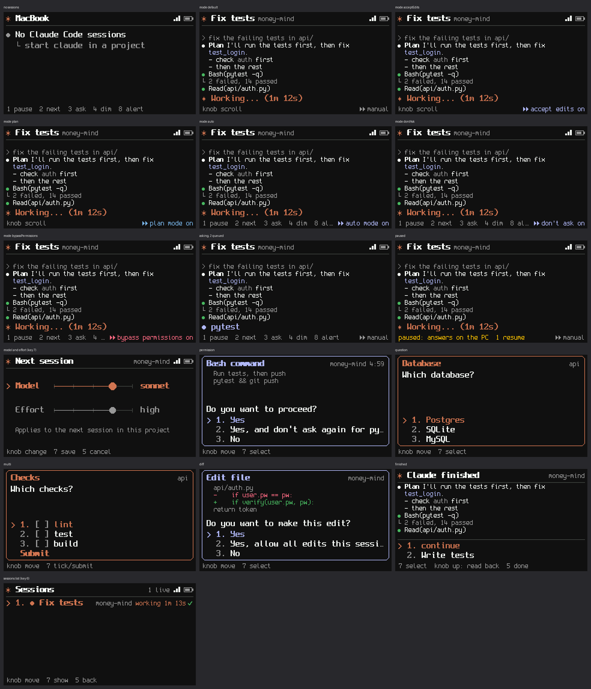

# Keypad

A hardware keypad for [Claude Code](https://claude.com/claude-code). A small color screen mirrors your open sessions; eight keys and a knob answer permission prompts and questions and tell Claude to continue. It talks to the PC over Wi-Fi (USB is for power, pairing and flashing). macOS and Windows.

## Keys

| Key | Does |
|---|---|
| 1 2 3 | pick option 1, 2 or 3 |
| 4 / 8 | up / down: move the cursor, scroll the transcript |
| 7 | Enter: select the highlighted option |
| 5 | back; *done* on the "Claude finished" screen. Does nothing on a decision |
| 6 | session list |
| knob | turn = 4/8, press = 7 |

## What it does

- **Live feed:** the transcript of the selected session: your prompts, Claude's text (Markdown laid out for the screen), tool calls, errors, elapsed time, permission mode.
- **Decisions:** permission prompts (*Yes / Yes, don't ask again / No*, edits shown as a diff), `AskUserQuestion` (single and multi-select), and when Claude finishes: *continue* or a saved prompt.
- **Saved prompts:** instructions you define in the tray, sent from the keypad to the shown session.
- **Fallback:** if the keypad is paused, unreachable or not answered within 5 minutes, Claude Code asks in the terminal as usual. If you answer in the terminal first, the keypad dialog closes. Nothing is ever auto-approved.

## Install

**macOS 12+:** open `Keypad-<version>.dmg`, drag Keypad to Applications, open it. Builds are not notarized: *System Settings → Privacy & Security → Open Anyway* once, and allow *Local Network*.

**Windows 10/11:** run `Keypad-<version>-setup.exe` (no admin rights; *More info → Run anyway* if SmartScreen warns).

Keypad starts at login and lives in the menu bar / notification area. First run:

1. Click **Connect** to add its hooks to `~/.claude/settings.json` (backed up first). Restart open Claude Code sessions.
2. Flash the keypad once over USB (`make flash`, see [docs/DEVELOPMENT.md](docs/DEVELOPMENT.md)). Later updates: tray → your keypad → *Update firmware* (Wi-Fi).
3. Plug the keypad in with USB, tray → **Add keypad…**. A local page asks for a name, the 2.4 GHz Wi-Fi network and its password. When it shows *Connected over Wi-Fi*, unplug the cable.

A keypad serves one PC. One PC can use several keypads; the first answer wins.

Build the keypad: [docs/HARDWARE.md](docs/HARDWARE.md).

## Settings

Tray → *Options*, *Saved prompts*, or edit `config.json` (reloaded on save).

| Key | Default | Meaning |
|---|---|---|
| `behavior.ask_when_finished` | 60 | seconds away from the PC before "Claude finished" is asked on the keypad; 0 always, -1 never |
| `behavior.timeout` | 300 | seconds the keypad waits for an answer before Claude Code asks in the terminal |
| `behavior.max_continues` | 20 | consecutive keypad continues before it asks for confirmation (also Claude Code's own cap) |
| `behavior.intercept_ask_user_question` | true | answer `AskUserQuestion` on the keypad |
| `log_level` | info | `debug` for more detail |

## Commands

`keypad tray` (default), `keypad agent` (no tray), `keypad install`, `keypad uninstall [--purge]`, `keypad status`, `keypad version`. `keypad hook <event>` is called by Claude Code.

## Files

| | macOS | Windows |
|---|---|---|
| settings, state (pairing keys), logs | `~/Library/Application Support/Keypad` | `%APPDATA%\Keypad` |
| hooks | `~/.claude/settings.json` | `%USERPROFILE%\.claude\settings.json` |
| login item | `~/Library/LaunchAgents/com.jameelhamdan.keypad.plist` | Task Scheduler task `Keypad` |
| program | `/Applications/Keypad.app/Contents/MacOS/keypad` | `%LOCALAPPDATA%\Programs\Keypad\keypad.exe` |

## Troubleshooting

| Problem | Try |
|---|---|
| *Waiting for your computer* | Keypad running (tray icon)? Same network? Paired? |
| Claude Code never asks on the keypad | Tray → *Claude Code integration* ticked; restart the session |
| Wi-Fi bars red | wrong password, or 5 GHz-only network: set up Wi-Fi again over USB |
| Paired, not found | same network; on macOS allow *Local Network*; `keypad status` |
| Anything else | tray → *Open logs folder* → `agent.log` |

Uninstall: macOS tray → *Uninstall Keypad…*, then trash the app. Windows: Apps & features. Settings and keys stay in the data folder unless you delete it (`keypad uninstall --purge`).

More: [architecture and security](docs/ARCHITECTURE.md) · [development](docs/DEVELOPMENT.md) · [wire protocol](proto/PROTOCOL.md)
