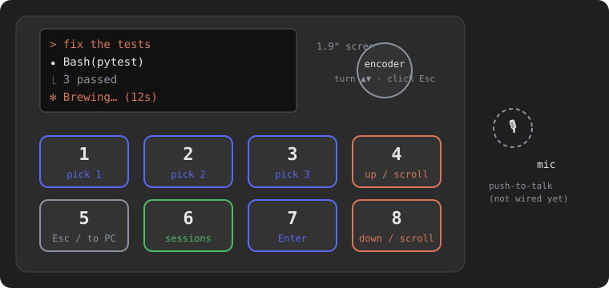
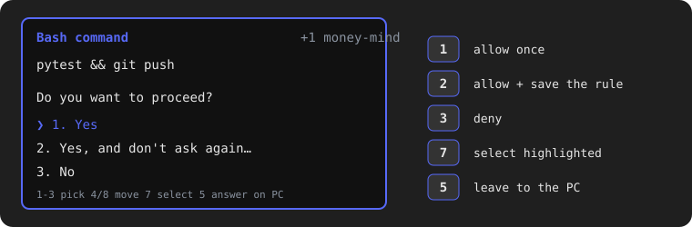
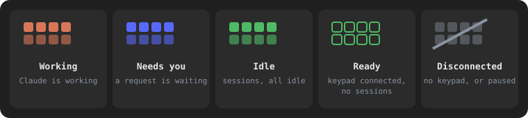
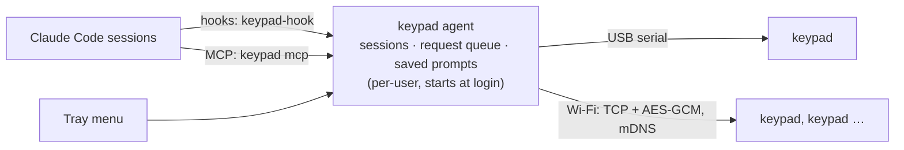
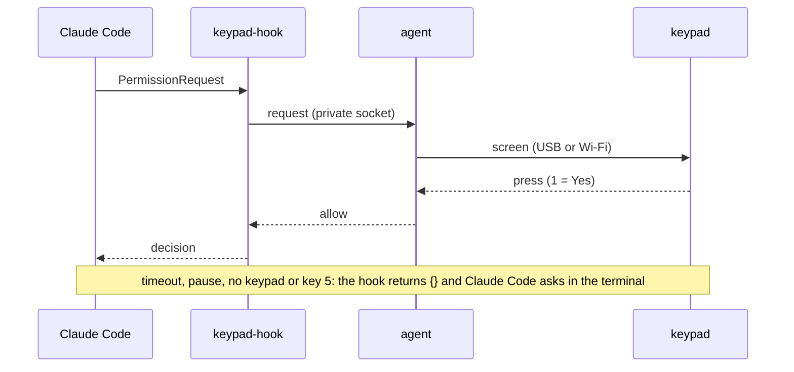

# Keypad

A small hardware keypad for [Claude Code](https://claude.com/claude-code): see
what Claude is doing on a color screen, and allow or deny tool use, answer
questions, or tell it to keep going, with one press. It works over USB or
Wi-Fi, on macOS and Windows, across all your open Claude Code sessions (up to
32 tracked at once, 8 shown on a keypad).

It runs on a LILYGO T-Display S3 with a 2×4 key matrix and a rotary encoder
([hardware](docs/HARDWARE.md)).



The screen is a small Claude Code: the session's transcript (`> prompt`,
`⏺` messages and tool calls, `⎿` results, `✻ Brewing… (12s)`), its
permission dialogs with the `❯` cursor and numbered options, and the
permission mode (`⏵⏵ accept edits on`). The keys work like Claude Code's
keyboard: number keys pick, up/down move, Enter selects, Esc backs out.



## Features

- **Your session, mirrored:** the main screen is the terminal tab in miniature: its title, your prompt, Claude's messages, `⏺ Bash(pytest)` tool calls, `✻ Brewing… (1m 12s)` and the permission mode. **4/8** scroll back through the transcript.
- **Sessions you can see and switch:** the header shows which session is on screen and its place in the list (`2/3`). **6** opens the session list: every session the keypad mirrors, its state (working, needs you, idle), which one is shown, and *Follow latest activity*. The tray shows the same, and the menu bar shows the shown project (`money-mind 2/3`).
- **Permissions, like Claude Code:** *1. Yes*, *2. Yes, and don't ask again for …* (when Claude Code offers a rule; picking it saves that rule, exactly as in the terminal) and *3. No*.
- **Questions:** Claude's `AskUserQuestion` (single or multi-select) and the `ask_user` MCP tool, with the same numbered list and cursor.
- **When Claude finishes:** the transcript stays on screen with numbered options below it: *continue* and your saved prompts; **5** leaves it to the PC.
- **Hand-back to the PC:** start typing on the computer and the pending request goes back to the normal Claude Code prompt. **5** (Esc) does the same.
- **Dark and light themes:** set per keypad, or follow the computer's appearance.
- **Wi-Fi:** pair over USB once. After that it works anywhere on the LAN, encrypted, with no conflicts between keypads or PCs.
- **Arabic / RTL text** is shaped and laid out right-to-left on the device.
- **Configured from the tray:** saved prompts, when to ask, how long to wait, per-keypad theme, brightness and project filter.

Nothing is ever auto-approved. When the keypad isn't there, is paused, times out, or anything goes wrong, Claude Code behaves exactly as it does without it.

## Install

### macOS (12 or later)

1. Open `Keypad-<version>.dmg` and drag **Keypad** to **Applications**.
2. Open Keypad from Applications. If macOS says it can't verify the app (builds that aren't notarized), open **System Settings → Privacy & Security**, scroll down and click **Open Anyway**. This is needed only once.
3. Allow **Local Network** access when asked: Keypad needs it to reach the keypad over Wi-Fi.

### Windows (10 or 11)

1. Run `Keypad-<version>-setup.exe`. No administrator rights are needed. It installs to `%LOCALAPPDATA%\Programs\Keypad`.
2. If SmartScreen warns about an unknown publisher, click **More info → Run anyway**.

### Then, on both

Keypad now starts at login and shows a small keypad icon in the menu bar (macOS) or the notification area (Windows; it may be under the **^** arrow). Everything is in that icon's menu; there is no separate settings window. The first time:

1. **Claude Code:** on macOS, Keypad asks *Connect Claude Code to the keypad?* Click **Connect**. (The Windows installer does this step for you.) It adds Keypad's hooks and its `keypad` MCP server to `~/.claude`, after backing up `settings.json`. To change it later: tray menu → **Claude Code integration**.
2. **Restart** any Claude Code sessions that are already open, so they load the hooks.
3. **Plug the keypad in** with a USB-C cable. Within a few seconds it switches from *Waiting for your computer* to the status screen, and the tray lists it. Then pair it for Wi-Fi (see [Pair for Wi-Fi](#pair-for-wi-fi)): from then on the cable is only power and firmware flashing.

**First flash:** a new keypad needs the firmware once, over USB: quit Keypad from the tray, then run `make flash` (PlatformIO). After that, firmware updates come from the tray: your keypad → **Update firmware**.

## Update

Keypad checks [GitHub releases](https://github.com/jameelhamdan/assistant-keypad/releases) once a day and, if a newer one is out, notifies you once and adds **Update available: v…** to the tray menu; click it to open that release's page. It never downloads or installs anything itself:

- **macOS:** quit Keypad from the tray, open the new DMG and drag Keypad to Applications again (replacing the old app), then reopen it.
- **Windows:** run the new `Keypad-<version>-setup.exe` over the existing install. It upgrades in place (same entry in **Apps & features**, no duplicate) and reconnects Claude Code.

## Uninstall

- **macOS:** tray menu → **Uninstall Keypad…** removes the Claude Code hooks and login items, then move Keypad.app to the Trash. (Dragging the app to the Trash *first*, without uninstalling, leaves its login items behind — pointing at a binary that no longer exists — and Claude Code's hooks still referencing it; run **Uninstall Keypad…** before you delete the app, or `keypad uninstall` from a terminal if you already deleted it.)
- **Windows:** uninstall from **Settings → Apps → Installed apps** (or Control Panel → Programs and Features) like any other app; it asks whether to also delete settings and pairing keys.

On both, settings and pairing keys (see [Where things live](#where-things-live)) are left behind by default so a later reinstall picks up where you left off; remove that folder yourself, or use its uninstaller's offer to delete it, for a clean slate.

## How to use

Keep working in Claude Code as usual. The keypad follows along and asks you when Claude needs you. The layout is fixed and works the same on every screen:

| Key | Does |
|---|---|
| **1 2 3** | pick option 1, 2 or 3 at once (Claude Code's number keys) |
| **4** / **8** | up / down: move the `❯` cursor, or scroll |
| **7** | Enter: select the highlighted option |
| **5** | Esc: back, or leave the request to the PC |
| **6** | the session list |
| encoder | turn = up/down, click = Esc (a stray knob press never decides anything) |
| mic *(optional ninth button)* | push-to-talk: hold to talk, release to stop. On GPIO14 (the board's right-hand button, or your own button to GND); the firmware and host handle it ([protocol](proto/PROTOCOL.md)), but no audio is captured yet |

**Main screen.** The session you're working in, like its terminal tab: the title, your last prompt, Claude's messages, the tools it runs and `✻ Brewing… (12s)` while it works. **4/8** scroll back through the transcript; **5** jumps back to the newest line (and to the latest activity, if you had picked a session). With saved prompts, **7** sends one to the shown session.

**Sessions.** The header shows the shown session and its place in the list (`2/3`). **6** opens the list: each session's title, project and state (*working 1m*, *needs you*, *idle*), a ✓ on the one shown, and *Follow latest activity* at the top. Pick with **4/8** and **7** (or **1–3**). While a request is on screen, the keypad shows the session that asked.

**When Claude needs you,** a dialog appears, with the first option highlighted:

| Screen | Options |
|---|---|
| Permission (*Bash command*) | **1** Yes · **2** Yes, and don't ask again for … (when Claude Code offers it) · then No |
| Question (Claude's `AskUserQuestion`) | numbered options; **4/8** + **7** for any of them |
| Multi-select | **1–3** or **7** tick options; *Submit* is the last row |
| Permission to edit or create a file | the change as a diff: `+` lines green, `-` lines red (**4** on the first option scrolls it) |
| Claude finished (only when you've been away from the computer, 1 minute by default) | the transcript, then **1** continue and your saved prompts; **5** stops there. **4** scrolls back through Claude's message |

- A long command or plan: press **4** on the first option to scroll the text; **8** comes back to the options. Enter never decides while you're reading.
- **Answer on the PC instead:** press **5**, or just start typing on the computer. The request goes back to Claude Code's normal prompt.
- **The screen dims** after a minute without a key press, and lights up fully when Claude needs you. The first key press on a dim screen only wakes it.
- **Sessions are remembered** when Keypad restarts, transcripts included (kept, already redacted, in `sessions.json` in Keypad's data folder, readable only by you).
- Requests from all sessions wait in line, one at a time. The dialog shows its project, how many more wait (`+1`) and a countdown before the PC takes over.
- **Nothing is ever approved without a press.** If the keypad is unplugged, paused, times out or anything fails, Claude Code behaves exactly as it does without it.
- **Key test:** while the keypad shows *Waiting for your computer*, hold **1**. Hold **8** to leave.

### The tray menu

Click the keypad icon in the menu bar or notification area. The icon has three looks:



- **Filled keys** (a keypad is connected and sessions are open): **orange** Claude is working, **blue** waiting for you, **green** all idle.
- **Outlined green keys:** a keypad is connected but no Claude Code session is open.
- **Dim, slashed keys:** no keypad connected, or paused.

- **Each keypad:** connection and battery, and a submenu with **Theme** (match computer, dark, light), **Brightness**, **Identify** (shows this computer's name on it), **Rename…**, **Only these projects…**, **Set up Wi-Fi…**, **Update firmware** and **Forget…**
- **Add keypad…**: pairs a keypad plugged in with USB, or explains how to connect one.
- **The shown session** is the second line (*Showing Fix tests (money-mind) · 2 of 3 sessions*); on macOS the menu bar shows `money-mind 2/3` next to the icon, on Windows the icon's tooltip says it.
- **Sessions on the keypad:** every live session with its state; the shown one is ticked. Click one to show it, or **Follow the latest activity**. A session a keypad doesn't list (its project filter) is marked *not on the keypad*. **Send to the shown session** sends a saved prompt (delivered with the session's next step, or your next prompt if it is idle).
- **Pause keypad:** leave every decision to the PC for now.
- **Options:** **When Claude finishes, ask on the keypad** (when you've been away 1, 2 or 5 minutes, always, or never), answer Claude's questions on the keypad, hand back to the PC when you type there and tell Claude a keypad is connected. Also **how long the keypad waits** for an answer, and **how many continues in a row** before it asks.
- **Saved prompts:** none at first. **Add saved prompt…**, and for each one **Edit…**, **Move up**, **Remove** (up to 16). They appear when Claude finishes and behind **7** on the main screen.
- **Claude Code integration** (connect or disconnect), **Start at login**, **Edit settings file…** (every setting, in `config.yaml`, applied when you save), **Open logs folder**, **Update available: v…** (only once one is, see [Update](#update)), **Uninstall Keypad…** (macOS only — see [Uninstall](#uninstall)), **Quit Keypad**.

Text (names, Wi-Fi details, saved prompts) is entered in small native pop-up dialogs.

## Pair for Wi-Fi

Keypad is **Wi-Fi only** by default: the cable is for power, this one-time pairing and flashing firmware. Until a keypad is paired, Keypad uses it over USB so you can set it up. Pair once:

1. Plug the keypad into this computer with USB.
2. Open the tray menu → **Add keypad…** (or your keypad → **Set up Wi-Fi…**).
3. Three dialogs ask for a name, the Wi-Fi network (filled in from your computer's) and its password.
4. The keypad shows *Paired. Joining Wi-Fi…*. When the Wi-Fi bars in its top-right corner light up, unplug it. It reconnects over Wi-Fi within about 10 seconds.

How it works: pairing gives the keypad a fresh secret key and this computer's id over the cable. From then on it accepts Wi-Fi connections only from this computer, encrypted with that key, and the computer finds it again by mDNS even if its IP changes. The keypad and computer must be on the same network (some guest or office networks block devices from seeing each other). 2.4 GHz Wi-Fi only.

- **USB afterwards:** once a keypad is paired, Keypad no longer opens its USB port, so `make flash` and serial monitors can use it freely. Tray → **Add keypad…** opens USB for 5 minutes for pairing. To also use the cable for decisions, untick *Wi-Fi only* under Options (`behavior.wifi_only` in `config.yaml`).
- **Another computer:** a keypad serves one computer over Wi-Fi. Pairing it from a second computer moves it there. Unpaired keypads work over USB on any computer running Keypad.
- **Change network:** plug it in and run **Set up Wi-Fi…** again.
- **Forget:** tray menu → your keypad → **Forget…**. If the keypad is connected, it also wipes its Wi-Fi settings.
- **Several keypads** can be paired with one computer. They all show the same request, and the first answer wins. Each one can be limited to certain projects (your keypad → **Only these projects…**).

### If something doesn't work

| Problem | Try |
|---|---|
| Keypad stays on *Waiting for your computer* | Check the tray icon is there (Keypad is running). On USB, try another cable: some are charge-only. |
| Claude Code never asks on the keypad | Tray → **Claude Code integration** should be ticked. Restart the Claude Code session afterwards. |
| Wi-Fi bars red, *can't join* | Wrong password, or a 5 GHz-only network. Plug in and set up Wi-Fi again. |
| Paired, but not found over Wi-Fi | Same network? On macOS, allow Keypad under System Settings → Privacy & Security → **Local Network**. |
| Something else | Tray → **Open logs folder** and look at `agent.log`. `keypad status` and `keypad claude status` show the current state. |

## How it fits together



The hooks, MCP server and tray reach the agent over a Unix socket / named pipe (this user only).

How a permission request travels:



- **One Python program** (`keypad`) does everything: the agent, the tray, the MCP shim and the CLI. The Claude Code hook is a separate small executable (`keypad-hook`, the same code as `keypad hook`) that loads only Python's standard library, so it starts quickly on every tool call.
- **Hooks → agent** over a private local socket, never a TCP port. If the agent isn't running, the hook prints `{}` right away.
- **Agent → keypads:** the same JSON messages over USB or Wi-Fi ([protocol](proto/PROTOCOL.md)). The PC connects to keypads it has paired. A keypad accepts only the computer that paired it over USB.
- **Firmware is a smart terminal.** The PC sends screens (a dialog, a multi-select, or choices under the transcript) and the sessions with their transcripts. The keypad owns the navigation (cursor, scrolling, the session list) and enforces the safety rules: clean single presses, a stale-press guard, and one answer per screen. The top-right corner shows `usb` and Wi-Fi bars for the live links.
- **Several sessions:** requests from every session are queued and shown one at a time, each labelled with its project. **Several keypads** mirror each other and the first answer wins. Each keypad can be limited to certain projects.

## Build from source

Requirements: Python 3.12+ with [uv](https://docs.astral.sh/uv/), PlatformIO, and on macOS the Xcode command-line tools. Releases bundle their own Python (PyInstaller), so users don't need one.

```sh
make setup           # host/.venv with every dependency (uv sync)
make test            # host tests (pytest) + firmware unit tests (native)
make lint            # ruff
make firmware        # build the firmware
make flash           # flash over USB (quit Keypad first: it holds the port)
                     # pio run -e keypad-debug -t upload: logs keys, accepts simulated presses
make mac             # dist/Keypad.app + DMG
```

On Windows: `packaging\windows\build.ps1 -Version 1.2.3` builds `dist\Keypad` (`keypad.exe`, `keypadw.exe`, `keypad-hook.exe`) and, with Inno Setup installed, the installer.

Run from source: `host/.venv/bin/keypad <command>` (for example `keypad agent`, `keypad tray`, `keypad status`). `keypad install` points Claude Code's hooks and the login items at that program.

Develop without hardware: `keypad agent --fake-device allow` attaches a simulated keypad that answers everything (policies: `first`, `allow`, `deny`, `continue`, `pc`, `none`). `KEYPAD_HOME=<dir>` isolates settings and state; `KEYPAD_NO_USB=1` makes the agent reach keypads over Wi-Fi only.

```
host/       Python: keypad/{core,device} + agent, tray, hook, MCP server, IPC, settings, installers; tests/
firmware/   PlatformIO: src/{app,ui,link,input,crypto,ota,store}, src/text (wrapping, Arabic)
proto/      wire protocol
packaging/  PyInstaller spec, app icon, macOS DMG, Windows installer
docs/       hardware, security, testing
```

## Where things live

| | macOS | Windows |
|---|---|---|
| Settings, pairing keys, logs | `~/Library/Application Support/Keypad` | `%APPDATA%\Keypad` |
| Claude Code hooks | `~/.claude/settings.json` | `%USERPROFILE%\.claude\settings.json` |
| Login items | `~/Library/LaunchAgents/com.jameelhamdan.keypad.*.plist` | Task Scheduler "Keypad Agent" + Run key |
| The `keypad` command | `/Applications/Keypad.app/Contents/MacOS/keypad` | `%LOCALAPPDATA%\Programs\Keypad\keypad.exe` |

`keypad status` shows keypads and sessions. `keypad claude status` checks the integration. `keypad config` opens the settings file. `keypad uninstall` removes the hooks and login items (settings and pairing keys stay; add `--purge` to remove those too).
