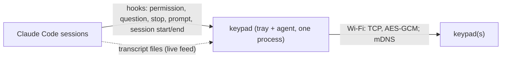

# Architecture

## Host (`host/keypad`)

One program, `keypad`. The tray hosts the agent; `keypad agent` runs it alone; `keypad hook <event>` is what Claude Code calls.

| Module | Role |
|---|---|
| `hook.py` | the hook command: standard library only (it starts on every prompt and decision), forwards a slimmed payload to the agent, prints `{}` on any failure |
| `ipc.py`, `server.py` | agent API on `127.0.0.1`, random port, token in `agent.json`; length-prefixed JSON; routes in `server.py` |
| `core/agent.py` | wires sessions, dialogs, keypads, settings; pushes `status` and `feed` to keypads |
| `core/hooks.py` | decisions: permission, `AskUserQuestion`, stop (continue / saved prompt) |
| `core/dialogs.py` | one dialog owns the keypads at a time, FIFO across sessions; validates presses |
| `core/sessions.py` | session registry; groups internal states into the five words the keypad shows (`PHASES`) |
| `core/transcript.py`, `core/markdown.py` | follow a session's transcript file; lay Claude's Markdown out for the screen |
| `device/hub.py` | finds (mDNS), dials, supervises keypads; pairing over USB; firmware update |
| `device/links.py`, `secure.py` | USB serial and Wi-Fi transports; handshake and AES-GCM framing |
| `claudecfg.py` | adds and removes our hooks in `~/.claude/settings.json` (backup first, only our entries) |
| `tray.py`, `trayos.py`, `dialog.py`, `pairpage.py`, `service.py` | tray menu, OS workarounds, native pop-ups, local pairing page, login item |

## Firmware (`firmware/src`)

A terminal: it draws what the host sends and owns navigation and press safety. `app` (messages, keys, state) · `ui` (all drawing) · `link` (Wi-Fi, mDNS, TCP) · `crypto` · `input` (matrix, encoder) · `ota` · `store` (NVS) · `power` · `text` (word wrap, glyph mapping).

## Flows

- **Feed.** The agent polls each session's transcript file (0.3 s). The selected session's transcript is sent to each keypad as a `feed` whenever it changes. Thinking, tool output and file contents are never read into it.
- **Decision.** Claude Code runs the hook → the agent queues a dialog → `screen` goes to the keypads → a `press` returns → the hook prints the decision. The dialog ends on a press, on `behavior.timeout`, when the keypad disconnects, or when the transcript shows Claude moved on (answered in the terminal). Any end other than a press returns `{}` and Claude Code asks itself.
- **Stop.** When Claude finishes and you have been away for `ask_when_finished` seconds, the keypad offers *continue* and saved prompts; the hook answers `block` with an instruction. A counter limits consecutive continues.
- **Pairing.** Only over USB: the host sends Wi-Fi credentials, its id and a new 32-byte key; the keypad stores them in NVS. The host then finds the keypad by mDNS (last IP as fallback) and connects. USB ports are opened only while the pairing page is open.
- **Login item.** launchd job / Task Scheduler task running `keypad tray --quiet`; restarted a minute after a crash, not after *Quit*.

## Security

| Rule | Where |
|---|---|
| No decision without a key press | `core/hooks.py` decides only from a `press` on the active screen id that the screen offered (`dialogs.press_matches`); every other outcome returns `{}` |
| Nothing is auto-approved | no setting changes permission modes, adds allow rules by itself, or passes `--dangerously-skip-permissions`. *Don't ask again* saves exactly the rule Claude Code suggested, only when picked |
| Stale and ghost presses | a press must start ≥150 ms after its screen appeared with no other key down; each screen is answered once; the host drops a press for any screen but the one on display |
| Pairing needs the cable | `provision` is accepted over USB only; `unpair` over USB or from the paired host |
| Wi-Fi link | the host connects out; the keypad accepts only its paired host id; HKDF-SHA256 keys from the pairing key and both nonces; AES-256-GCM with implicit counters, so a forged, replayed or reordered frame ends the session |
| Local API | loopback only, requires the token in `agent.json`. Any program running as your user can read that file; that is the boundary |
| Private files | `state.json` (pairing keys), `agent.json`, `settings.json` backups: mode 0600 on macOS. On Windows they rely on the per-user `%APPDATA%` ACL (other non-admin accounts cannot read them). `config.json` holds no secrets |
| What reaches the device | your prompts, Claude's text, tool names with a one-line summary, error lines. `core.text.redact` hides common secret patterns (`api_key=…`, `sk-…`, `ghp_…`, `AKIA…`); it is best effort, not a guarantee |
| Continue loop | consecutive keypad continues are counted; at `max_continues` the keypad asks for explicit confirmation |
| Installer scope | touches only our hook entries and `CLAUDE_CODE_STOP_HOOK_BLOCK_CAP`; backs up `settings.json` (keeps 5) |

## Failure behaviour

| Failure | Result |
|---|---|
| keypad unplugged, out of range, agent not running, paused | the hook returns `{}` in milliseconds; Claude Code asks in the terminal |
| no press in time, or you answer in the terminal | the keypad screen closes; Claude Code asks in the terminal |
| keypad reboots mid-request | the host re-sends the active screen |
| transcript format not recognized | the feed stays empty; `keypad status` shows `unreadable`; one log line |
| host and keypad protocol versions differ | the tray says to flash the keypad over USB |
